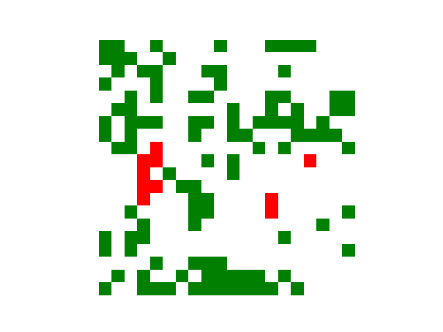

# Forest fire model

This is a quick implementation of the forest fire model. Here I am loosely following: https://doi.org/10.1016/S0031-9201(98)00167-8

1. Make sure you have the latest version of conda installed.
1. Install the dependencies and create a new conda environment.

```bash
cd forest_fire
conda env create -f environment.yml
conda acitvate forest_fire
```

## Examples

```python
forest_fire_automota = ForestFire(
    num_x=20,
    num_y=20,
    spark_frequency=1,
    tree_frequency=5,
)
for timestep in range(10050): 
    forest_fire_automota.step()
    if timestep > 10000:
        forest_fire_automota.log()
forest_fire_automota.make_gif()
```

